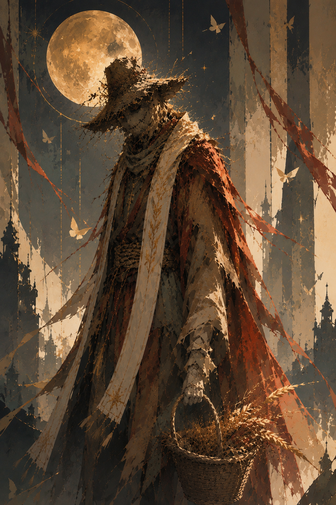
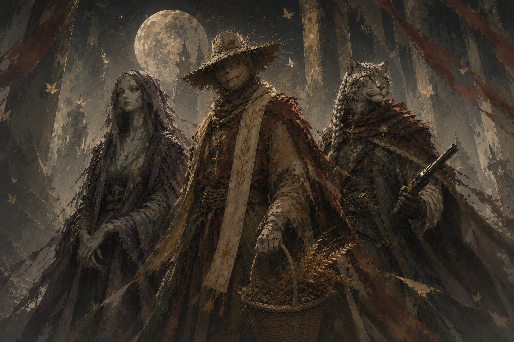

# Magerna

*(Magerna Starblood)*

**Type:** Player Character
**Campaign Appearances:** CAMPAIGN 4 — Past and Future, Dusk and Dawn (referenced), CAMPAIGN 5 — Loss, Legacy, and Lament

*⚠️ Naming note: goes by "Magerna Starblood" as of Campaign 5 specifically to distinguish this incarnation from the version of the character previously played in an unrelated, non-Mythrir campaign ("Tyranny"). Both share the name and broad concept but are explicitly different individuals — flagging the connection rather than merging them.*

---

## Overview

A tattered, ancient scarecrow given true consciousness — currently the Aspect of Lament, one rank below the Worldcrafter himself in the setting's divine hierarchy (Mortal → Champion → Demigod → Lesser God → Greater God → Aspect). A Twilight Cleric who can fly in dim light. Older and shaggier in Campaign 5 than in his earlier appearances, perpetually a little damp.

---

## Origin

Stood on the farm of Magerna Modril for generations before gaining true awareness — a passive presence through that time, registering only fragmentary impressions: children playing in the fields, bountiful harvests, the sorrow of burials. The farm's ancestors thanked the scarecrow daily for protecting their harvest from crows, and that accumulated gratitude, over decades and centuries, settled into the straw man's heart — coinciding with an echo of Un'Malo, the World Crafter's Aspect of Vengeance (killed in Campaign 2), coalescing within him.

True consciousness arrived only when Magerna Modril, the farmer — in his seventies, the last of his line, erased alongside the rest of his family by the encroaching darkness of Feit (not the Nothingness or the Beyond, both of which are explicitly separate phenomena in this setting) — was killed. Magerna's first act as a cognizant being was burying his own father.

---

## Divine Progression

Originally manifested as a spirit of vengeance, channeling Un'Malo's aspect directly — single-minded, willing to pursue "rightness at any cost." Over the roughly 2,000 years since, that fury dulled first into a pursuit of justice rather than vengeance ("if we can't save you, we will avenge you," tempered by patience rather than fury), and eventually settled into lamentation: remembering and mourning the way things had to be, rather than actively seeking to punish anyone for it. Currently holds the rank of Aspect of Lament.

---

## Campaign 5 Session Detail

Session 0.5 — The Reunion at the Cat's PajamasAttempts to revive Teyou with Mass Heal, reads his will aloud, and receives his own letter about vengeance never being a home.

Present at the once-a-century reunion of immortals at the Cat's Pajamas in Veranath. Greets Thelonius and asks after Barry, brewer of the tavern's house ale — learning that the original Barry was a mortal barkeep murdered in cold blood during Tycho's own mortal lifetime, with the killer executed shortly before Tycho's ascension. Present for Teyou Zhiang's death at the table; attempts to revive him immediately with a 9th-level Mass Heal, which fizzles outright, confirming the World Crafter's essence is genuinely gone rather than merely lost. Reads aloud from Teyou's recovered will and testament, delivering letters to the other recipients present.

Receives his own letter from Teyou's will: *"Vengeance was never meant to be a home, only a road. You reached the destination centuries ago. Nobody told you. I'm sorry. But you should plant something."* Enclosed is a handful of black, loamy topsoil, confirmed as soil from his own family's long-lost ancestral farm — generations of his line are buried in it. Reacts with visible sorrow (his straw form weeping a moisture he otherwise can't produce as tears) and reflects on the burial of his father and the looming burial of Teyou.

Personally delivers Thelonius's letter from the same will — *"You never stopped complaining about this. I kept it anyway. Somebody has to remember who you were before you became who you are,"* enclosing a cat collar — and pockets the letter addressed to Feit, intending to deliver it himself. The letters addressed to Nakki and Tin remain undelivered as of session's end.

Touches the mysterious beggar who remarks on Teyou's death, prompting an unsolicited, formal prophecy about seven worlds each fearing something different, interrupting Magerna's own attempt to cast Death Ward.

Session 1 — The Broken BladeTails the beggar, moonbeams the untouchable Owl, and heals the beggar's body — but not his broken mind.

Asks Thelonius directly where to put a dead god's body ("Would you like to keep a god of all things in your basement?"). Follows Bas in tailing the beggar, declaring he senses no vengeance or justice owed here — only questions of his own. Casts Moonbeam on a robed, owl-masked figure spotted on a rooftop; it singes the figure's robe and nothing more, consistent with his own knowledge of the Owls from before Feit's corruption of them. When a goblin attacks the beggar, lays Death Ward, then his Empathy ability (redirecting the beggar's damage onto himself) and Sanctuary — none of it stops a cursed, self-healing shiv from repeatedly wounding the beggar until Bas ends the fight. Fully heals the beggar's body with Cure Wounds, but Break Enchantment finds nothing to break — the man was never charmed or possessed; his mind is broken by something else entirely, a day lived over and over. Magerna's parting words as the beggar walks off toward the Hall of the Owls: *"I will remember you and I will mourn you."* Present when Meeka confirms Feit's return and reappears in her newly self-made body.

Session 2 — Before Me Is DeathQuestions whether he's still an aspect of lament, invites 702 into Zone of Truth, and takes in the rescued goblin child on House Modril's behalf.

Addresses Thelonius as "Rememberer" and, gripping his scythe tight enough that it radiates visible cold at the mention of Feit, asks whether he could go back to being an aspect of vengeance rather than lament — Thelonius demurs ("that is not for me to decide"), and Magerna's own answer is uncertain: *"With the maker gone, anything's possible, or nothing's possible."* Insists on personally delivering news of the goblin-camp massacre rather than leaving it undone, and is the one to name what's needed afterward — not vengeance, but flowers (poppies, lilies) and a name for the sole survivor. Casts Zone of Truth around (not on) 702 Purpose and Intent, inviting rather than forcing his cooperation; 702 accepts and intentionally fails his save. Leaves 702 with an unsettling parting line: *"How many times does someone get to have vengeance twice?"* Takes the rescued goblin child in on House Modril's behalf without hesitation.

*Family connection resolved: [House Modril](../Factions/House%20Modril) — the noble charitable house whose orphanage network takes in the rescued goblin child in Session 2 — was founded by Marty, eldest of the orphaned children the farmer Magerna Modril raised, not by blood descent. House Modril has never claimed descent from Magerna, nor has Magerna ever accepted membership within it; the House simply calls him "The Farmer." Previously flagged as an unresolved tension against the farmer's own origin story establishing him as "the last of his line" — resolved by GM-provided background lore confirming the relationship is reverence, not inheritance.*

See [Campaign 5 - Loss, Legacy, and Lament - Overall Summary](../Sessions/Campaign 5 - Loss, Legacy, and Lament - Overall Summary) for full scene detail.

---

## Notes

*Class, race, stats, weapons, and magic items to be added here as they're established in session.*

---

## Appendix: Concept Art

*Magerna.*

*With Bas and Meeka.*
