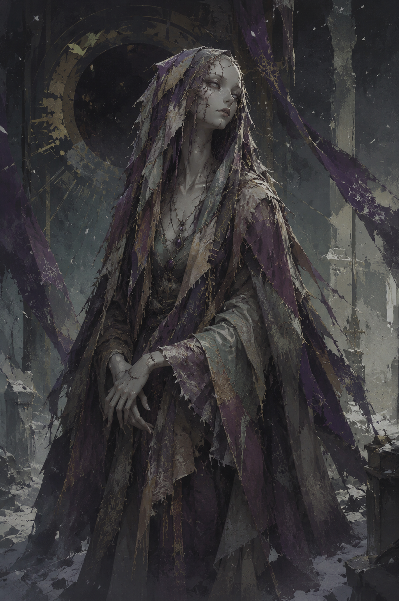
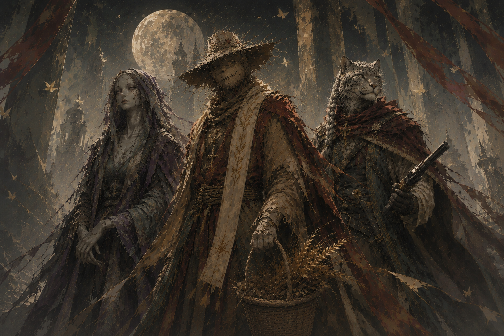

# Meeka

**Type:** Player Character  
**Campaign Appearances:** CAMPAIGN 4 — Past and Future, Dusk and Dawn, CAMPAIGN 5 — Loss, Legacy, and Lament

---

## Overview

God of All Lost Things. Ancient carved wood mask as her face — two horns, slit eyes that curve upward, and a sealed mouth cracking open from within. She presides over an infinite bazaar of everything ever lost or forgotten, including the imprisoned soul of Madam Lennette. Transactional, possessive, and unsettling. Every deal has a price. Hates Feit with a passion that predates the current age.

**Divine rank (confirmed Campaign 5):** Likely the Aspect of the Lost — second only to Teyou Zhiang, the Worldcrafter, in divine power, per the campaign's established rank order (Mortal → Champion → Demigod → Lesser God → Greater God → Aspect).

**Origin confirmed (Campaign 5):** Her first form was a doll — the same one later used to imprison Madam Lennette some four thousand years ago.

---

## Campaign 4 Session Detail

Hosts the party at her bazaar in a scene centered on Madam Lennette's screaming rag doll, which she gives to Galv as teleportation fuel. Distributes the four Moa pendants tied to Loanar's lore. Ultimately restores Seraph's soul after his Geas-bound corruption and redemption arc resolves.

---

## Campaign 5 Session Detail

Session 0.5 — The Reunion at the Cat's PajamasHeld Bas in her employ for 500 years; watches Teyou die from hiding and confirms his essence is gone, not merely lost.

Confirmed: held Bas Tetran XXIV in her employ for 500 years as the price of rescuing him when the last Frost Shepherds were scattered at the end of Campaign 4. Present, hidden, at the century-mark reunion at the Cat's Pajamas in Veranath when Teyou Zhiang dies at the table; her grief at his death is involuntary and unstated but visible — the room erodes and the table's food rots around her before she reveals herself from a coalesced mass of dust and discarded objects in the tavern's darkest corner. Confirms, from her own perspective as the god of lost (not gone) things, that Teyou's essence is not lost — it is gone outright, a distinction that visibly unsettles her. Receives a short letter from Teyou's will: "I found this. I thought you might want it back. You owe me one favor. — Teyou," along with a plain wooden button — the missing eye from her original doll form.

Session 1 — The Broken BladeTakes Teyou's body into her own domain, tries Banishment on the Owl, and returns wrapping the cursed shard in an entirely new, self-constructed body.

Takes Teyou's body into her own mass and sinks away with it — he "doesn't belong in this world at all." Answers Bas's shorthand summons (a deliberately lost gold coin) mid-investigation and, on arrival, tries Banishment on the returned Owl; it works only long enough to knock the Owl's scroll case loose before it rises back out of its own dropped scroll, unbothered. Wraps the broken, voice-bearing Tychonium shard in her own refuse rather than leave it in the street and carries it back to her domain herself. Returns wearing an entirely new form for the first time anyone at the table has seen: a deliberately constructed humanoid body stitched from snakeskin and the discolored hide of many different creatures, black void visible in the gaps between the stitching. Confirms outright whose voice the shard carried — *"He's back. Who else would have said those words?"* — and connects Feit's return to the "cracks" left by the Worldcrafter's death.

Session 2 — Before Me Is DeathHer new body is confirmed permanent; Divine Intervention is formalized, and she pulls Liberty of the End as her first artifact.

Her new constructed body is confirmed permanent, not a one-scene transformation. The table formalizes how Divine Intervention works for a player character who is also her own god: at 20th level her calls succeed automatically, letting her draw any single inactive artifact — one previously wielded by an earlier player character — out of her own domain for one use, on a one-week cooldown. Her first pull is [Liberty of the End](../Items/liberty-of-the-end), Seraph's old hourglass artifact. Initially balks at joining the trip to the goblin camp ("I'm more just confused as to where I said I was joining you") until she hears Teyou's voice in her own head — *"Don't forget you owe me"* — and immediately reverses herself. Reveals, without elaborating, that she holds an unspecified "piece" of 702 Purpose and Intent (his word: "peace"), taken at some unspecified point, and refuses to return it: *"How he is now is what's needed."* Activates Liberty of the End's Stars Without Number ability to close out the session, rolling 22 miles and a southward heading to land the party just outside the Maw of Arrath.

Session 3 — The Found, The Celebrant, and The EphemeralIs contacted directly by a being wearing relics from her own Bazaar, then opens the Bazaar itself for the party — where a box confirms the Found is her own mirror opposite.

Is the first one addressed directly, telepathically, by the Found — a being whose entire body is built from cleanly-arranged items she recognizes on sight as stock from her own Bazaar of the Lost. Casts Holy Weapon on Bas's blade once his ancestral weapons are stripped of their magic, and attempts Blindness on the Found, only for it to burn one of its own legendary resistances to shrug it off. After the fight, opens a passage into her own Bazaar so the party can regroup somewhere defensible, and reads clean through Bas's deflection about the faces he saw in the Ephemeral without commenting on it. Inside the Bazaar, finds a box she didn't leave there herself, containing a stereograph that confirms the Found as her own mirror opposite — and hears a door close somewhere else in the Bazaar as the session ends.

See [Campaign 5 - Loss, Legacy, and Lament - Overall Summary](../Sessions/campaign-5-loss-legacy-and-lament-overall-summary) for full scene detail.

---

## Notes

*Class, race, stats, weapons, and magic items to be added here as they're established in session.*

---

## Appendix: Concept Art

*Meeka.*

*With Bas and Magerna.*
