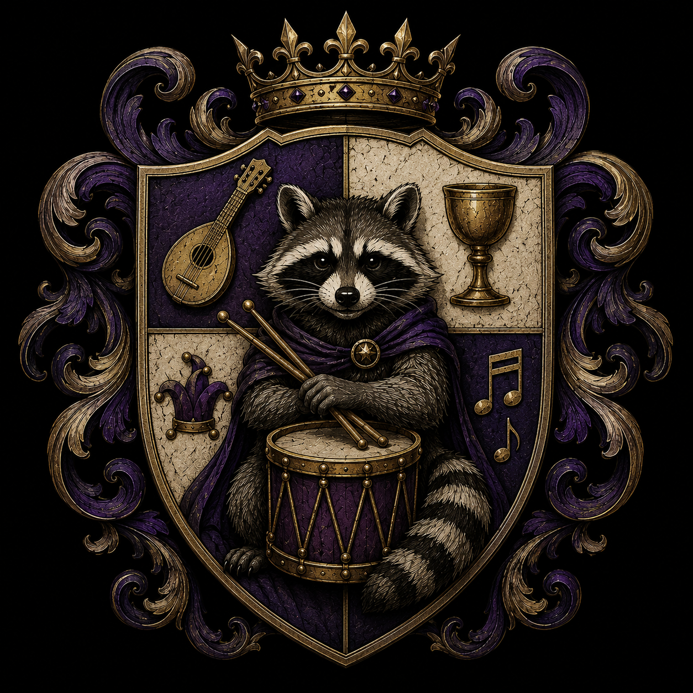

# House Richardson

**Type:** Great House (non-noble by blood — a house built on accumulated favors)
**Founded:** 1,903 years ago
**Founder:** Bruce Richardson, Bard of the Maw
**Companion:** Milton, a common raccoon remembered in family chronicles as "Milton the Faithful"
**Seat:** The Maw of Arrath (the Maw)
**Sigil:** A raccoon seated proudly behind a drum
**Colors:** Royal Purple, Ivory, and Burnished Gold
**Motto:** *"Fortune Favors the Fearless."*
**Campaign Appearances:** CAMPAIGN 5 — Loss, Legacy, and Lament (referenced from earlier eras)

*⚠️ Motto discrepancy: GM-provided background lore gives the House's formal motto as "Fortune Favors the Fearless," distinct from "Always leave the table with more friends than you sat down with" — previously recorded here as the (unofficial) motto from session play. The background lore itself frames the "leave the table" line as a separate old saying told *about* the House ("Never gamble against a Richardson... they always leave the table with more friends than they sat down with"), not the motto itself. Keeping both on file rather than silently picking one.*

---

## Overview

A great house of the Maw that holds no currency and commands no army, built entirely on favors owed. Among the oldest Great Houses of Mythrir, none has a more ridiculous origin: founder Bruce Richardson owned no land, held no title, won no famous battles, and spent what little coin he had on ale, songs, and impossible adventures. He also happened to be one of the most charming men who ever lived.

Bruce wandered Mythrir in the years immediately following Feit's disappearance with only a travel pack, a battered lute, and Milton — an unusually intelligent raccoon who insisted on carrying a tiny drum wherever they went (whether Milton truly understood music or simply enjoyed making noise remains a matter of scholarly debate). Together they found themselves at the center of history with startling regularity: exposing corrupt magistrates without meaning to, brokering peace between rival villages while trying to earn a free supper, recovering priceless relics after getting lost on the way to a concert, and once accidentally preventing a civil war after Bruce insulted both claimants to a throne so thoroughly they joined forces just to throw him out of the kingdom. By the end of his life Bruce had neither vast wealth nor legendary power — instead, he had something rarer: everyone owed him a favor.

When Bruce finally settled in the Maw, the communities that had grown up around his travels declared him their lord despite his objections. By family tradition, he accepted the title only after Milton climbed onto his shoulder and struck three slow beats on his drum — the House has considered those three beats its official founding ever since.

House Richardson holds no standing military, because attacking it would draw the collective retaliation of everyone who owes it a favor. They rule the Maw through diplomacy, hospitality, trade, and an uncanny ability to make friends where other rulers make enemies — their estates are famous for festivals lasting days, guest halls where no traveler is refused a meal, and musicians whose performances are treated as matters of state. It's said a Richardson can end an argument simply by asking everyone to sit down and share a drink — and more remarkably, they usually succeed.

---

## Milton's Feast

Held every year in the middle of Junathar (the Mythrir equivalent of June), at the Maw. Representatives of the great houses and major cities from across the world attend, and the head of House Richardson personally serves every guest at the table. Every year, the High Lord personally places the first serving of every meal upon a small empty table before anyone else may eat — the place reserved for Milton, regardless of whether Bruce or Milton are still alive to occupy it. No one remembers who began the tradition, and no one has ever dared end it.

Visitors occasionally remark that the food on Milton's table is often gone by morning. The servants insist the kitchen staff clears it away; the kitchen staff insist they do not. House Richardson has never investigated the matter very closely — some traditions are more enjoyable left unexplained.

*See also: [Mythrir Calendar and Festivals](../Lore/Mythrir%20Calendar%20and%20Festivals) places Milton's Feast on High Summer 25 — the actual calendar month; "Junathar" was an offhand table joke riffing on "June," not a real month name.*

**Campaign 5, Session 2:** Thelonius sends Bas, Magerna, and Meeka to attend this year's Feast as Verenath's official representatives, hoping the favor they earn there will smooth the way to an audience with the Master of the Forges at the Scarlet Peaks — something House Volkan's pride would otherwise make impossible, given the party's broken Tychonium shard. See [Campaign 5 - Loss, Legacy, and Lament - Overall Summary](../Sessions/Campaign 5 - Loss, Legacy, and Lament - Overall Summary) for full scene detail.

---

## Key Figures

| Name | Role | Notes |
|---|---|---|
| Bruce Richardson | Founder | Musician turned favor-broker; by old age owned most of the Maw. Status in Campaign 5 unconfirmed — not stated whether he is still alive. |
| Milton | Bruce's magical raccoon companion / drummer | Played drums for Bruce's act. A place is left open for him at every Feast. |

---

## Notes

*Whether Bruce Richardson or Milton are still alive as of Campaign 5, and who currently heads the house if not, is not addressed in session — flagging rather than assuming either way. Founding details, sigil, colors, and formal motto added from a standalone GM background-lore dump, not session play.*

---

## Appendix: Concept Art

*House Richardson's crest.*
