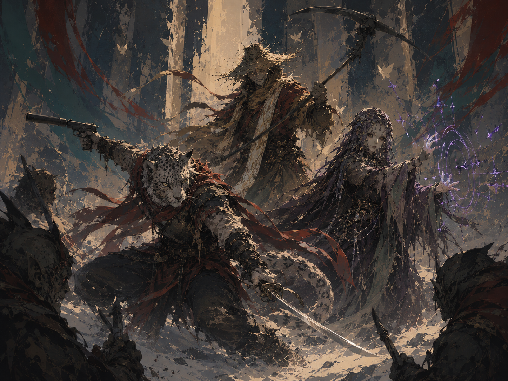
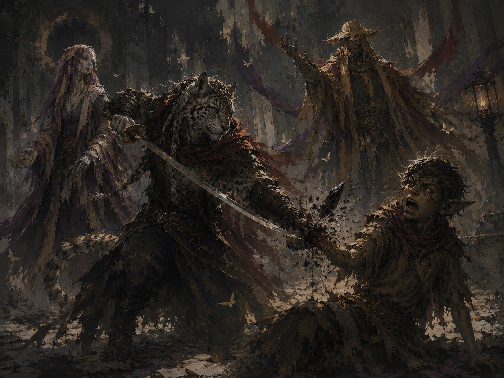

# The Shard

**Type:** Cursed Item — broken weapon fragment, Volcan Tychonium
**Owner:** Currently held in Meeka's domain
**Campaign Appearances:** CAMPAIGN 5 — Loss, Legacy, and Lament

---

## Item Table

| Item | 5e Description | Visual Adaptation |
|------|---------------|-------------------|
| The Shard | A broken piece of Tychonium, roughly six inches long and two to three inches wide at its widest, with a definite curve. Bears a Volcan master-smith's maker's mark and a single Volcan rune reading "Remember." Full mechanical properties not yet established in session. | A jagged, curved fragment of dull silver-gray metal — clearly once part of something larger and, per its Volcan stamp, once unbreakable. Faint black smoke clings to and moves through it after use. |

---

## Session 1 Session Detail

Wielded as a makeshift shiv by a goblin — later revealed to be no older than sixteen or seventeen — in an unprovoked attack on [The Beggar](../NPCs/The Beggar). Each time the shard glows, its wielder's wounds knit shut instantly and he ignores outside commands entirely, including an overridden Command spell; every hit it lands does exactly one point of damage that feels, per Bas, "old" — like an ache before rain — regardless of armor or temporary hit points in the way.

When Bas severs the goblin's hand (and the shard with it) using Yesiah, the goblin withers to dust on the spot and a thread of black smoke pours out of the wound and back into the shard — implying the goblin had already stopped being fully himself by that point.

Investigated directly by Bas afterward: confirmed as a broken Volcan-forged piece of Tychonium. Bas alone — no one else present — hears it speak: *"You are nothing without me."* Held near a separate, unconnected sliver of Tychonium (taken from Teyou Zhiang's own pocket), the two pieces visibly repel each other, like magnets of the same pole.

Too dangerous to carry — Meeka wraps it in her own refuse and takes it back to her domain rather than let it stay on the street or be carried by the party. Immediately afterward, Meeka confirms that the voice belongs to Feit: *"He's back. Who else would have said those words?"*

**Session 2 update:** The goblin who wielded the shard against the beggar is now named — **[Grit](../NPCs/Grit)**, per the sole survivor of his camp. Before that fight, the shard (as "a new piece of shiny") apparently came into Grit's possession and transformed him from small and chronically underfed to hobgoblin-sized and strong enough to single-handedly slaughter roughly twenty-five of his own campmates under the Western Bridge when they tried to take it from him. Thelonius confirms the shard as House Volkan work and handles it exclusively with his prosthetic metal arm rather than flesh. See [Grit](../NPCs/Grit) for how he found it.

---

## Historical Parallels

Standalone GM lore dumps outside session play describe at least two other, separately-named accounts of an object with the same signature line — *"You are nothing without me"* — and the same trade: power and vigor in exchange for the wielder's own memories and identity, repaid only while the object is held and lost again the instant it's set down.

- **An unnamed soldier**, wielding an object referred to only as "**the Broken Blade**," used it across a lifetime of escalating sacrifices — lifting a collapsed gate, outrunning dragonfire, winning a battle, then a kingdom — until he lost count. Each time he took up the blade, every stolen fragment of himself flooded back for a few glorious moments before draining away again the instant he let go, leaving him unable to recognize his own handwriting or the faces of his own family.
- **An unnamed smith's apprentice** found "a sliver" dismissed by his own smith as worthless, and drove himself through months of obsessive training chasing a hollow feeling that praise could never fill — until the shard's reflection spoke to him directly, and he chose to keep it rather than throw it into the fire.
- **Mara Modril** found a similar shard while farming and successfully refused it, talking it down rather than being consumed by it — see [House Modril](../Factions/House%20Modril) for the full story. Hers is the only known account of someone walking away.

Whether these are the same physical item as the party's shard, fragments of one original object shattered and scattered across history, or unrelated phenomena that simply share a voice and a method, is not established — flagging the pattern rather than asserting a connection. The recurring detail that each finder discovers only "a sliver" or "a shard" small enough to seem worthless is notable given the party's own shard is confirmed to be a broken piece of something larger.

---

## Notes

*Full extent of the shard's power, its exact relationship to Feit, and why it chose Grit are all unconfirmed as of Session 2 — flagging rather than speculating further. See [Campaign 5 - Loss, Legacy, and Lament - Overall Summary](../Sessions/Campaign 5 - Loss, Legacy, and Lament - Overall Summary) for full scene detail.*

---

## Appendix: Concept Art

*The fight against Grit, Session 1.*

*The killing blow that ends the fight — and the shard's hold on Grit.*
