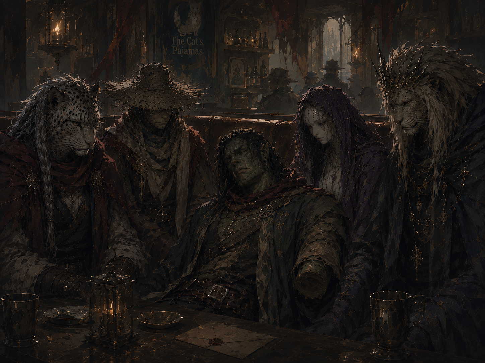
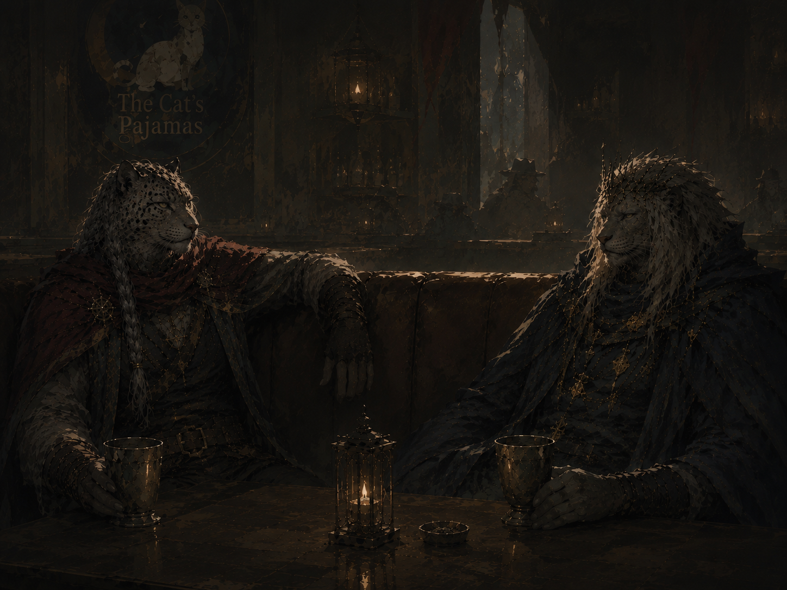

# Session 0.5 — The Reunion at the Cat's Pajamas

*The Worldcrafter Teyou Zhiang dies mid-drink at a century-old reunion, leaving behind a will, a prophecy, and the first sign of a new era.*

Part of [Campaign 5: Loss, Legacy, and Lament](Campaign%205%20-%20Loss,%20Legacy,%20and%20Lament%20-%20Overall%20Summary). See all sessions at [Session Recaps](Recaps).

---

### A century-old ritual, disrupted

For roughly two thousand years, Bas Tetran XXIV has used his immortality to keep a standing appointment: once every century, the long-lived and the divine who survived the fall of the last Frost Shepherds convene at the Cat's Pajamas in Veranath — a town that, under Thelonius's four-thousand-year stewardship as the Oathstone of Remembrance, has scarcely changed since Tycho, Meeka, and Seraph walked its streets as mortals. The ritual exists in part so survivors can simply confirm to each other that they're still standing, and in part as an early-warning system: anyone who doesn't make "the long walk" this time may be a sign that something in the world needs them back in action.

This session opens on one such gathering. Tycho — Master of the Long Walk, former Pridemaster, the God of Death — arrives at the bar with snowflakes in his mane despite it being the height of summer. He finds Bas already there, having arrived early out of old habit ("scope the place out"). The two share a silent drink and a shared recognition: snow over Veranath in summer is never a good omen, and it hasn't happened since the days of the last Frost Shepherds. They're soon joined by Magerna — now going by Magerna Starblood, the current Aspect of Lament, drifting in scarecrow form on the dim tavern light — and briefly by Nakki, who crashes through the kitchen, steals a drink off the table, declares her approval, and is chased out by bouncers before anyone can get more than a greeting in.

### Teyou Zhiang's death

A hush falls over the tavern as Teyou Zhiang — the Worldcrafter, the capital-G God of Mythrir, creator of all seventy-three worlds (Mythrir Prime among them being the original, all others later imitations) — walks in alone. He orders five drinks at the bar, carries them to the table himself, sets one in front of each of Bas, Tycho, and Magerna, leaves one in the booth's empty seat, sits, drinks, and dies without a word.

His magical prosthetic arm is gone entirely — not present on the body. Magerna immediately attempts to revive him with a 9th-level Mass Heal; the spell fizzles outright. Meeka, drawn out of hiding by the disturbance (the tavern's food visibly rotting and the room eroding around her unspoken grief), confirms from her own perspective that Teyou's essence is not merely lost, as is her usual domain — it is gone. Thelonius, distraught and briefly accusatory toward the table, is talked down by Bas, who points out, accurately, that none of them touched the god before he died.

Bas separately recognizes the moment for what it is: the same "space between moments" sensation he last felt in the instant before Aleer was murdered by Seraph and he himself was made Godblooded. He reads it as a warning that tragedy is close behind.

### The will and testament

Teyou's body yields a plainly labeled envelope ("the last will and testament of Teyou Zhiang") and a small bundled package — both conspicuously without divine flourish. The will's instructions: deliver several enclosed letters to specific named recipients. So far:

- **Bas Tetran XXIV** — a short letter naming the core of his two-thousand-year burden outright: *"You still think you survived because someone else died. I have watched you carry that burden longer than some nations existed. You were not chosen because you deserved to live. You lived because someone had to remember. The dead do not need you. The living still do."* Enclosed: a roughly six-inch wooden splinter. A high investigation check lets Bas recognize the specific impact mark on it — it's a fragment of a wagon-wheel spoke, broken and hammered back into place by hand during a mule-cart journey he once took with two other Frost Shepherds: Netiri and "Emp" — the Emperor (Za'a-ni), confirmed as a nickname.
- **Magerna** — a letter built around the same theme of arrested purpose: *"Vengeance was never meant to be a home, only a road. You reached the destination centuries ago. Nobody told you. I'm sorry. But you should plant something."* Enclosed: a handful of black, loamy topsoil — confirmed by Magerna as soil from his own family's long-lost ancestral farm, generations deep.
- **Meeka** — the shortest letter of the three read so far: *"I found this. I thought you might want it back. You owe me one favor. — Teyou."* Enclosed: a plain wooden button, instantly recognized as the missing eye from the doll that was Meeka's original form — the same doll used to imprison Madam Lennette some four thousand years ago.
- **Thelonius** — delivered in-scene immediately by Magerna: *"You never stopped complaining about this. I kept it anyway. Somebody has to remember who you were before you became who you are."* Enclosed: a cat collar. Thelonius's reaction is immediate, profane, and genuinely moved.
- **Still undelivered:** letters addressed to Nakki, Tin, and Feit. Magerna pockets the Feit letter, intending to deliver it personally; the Nakki and Tin letters remain outstanding as of session's end.

### The beggar's omen

As the scene's frozen "moment between moments" begins to release, an ordinary-looking human beggar — mid-50s to 60s, unremarkable, a known fixture around town who's never previously seemed supernatural — approaches the table, looks over the assembled immortals and Teyou's corpse, and remarks, simply: *"Huh. He's never died before."* Bas's insight check (28, effectively a guaranteed read) confirms the beggar isn't hiding anything — he's strange, but not being deceptive.

When Magerna reaches out and touches him, the beggar delivers an unprompted, formal-sounding prophecy before Magerna's own spell (Death Ward) is interrupted: *"The first world feared the dark, the second feared the sea. The third feared what watched between. The fourth feared the silent king. The fifth feared the falling stars. The sixth feared the end of days. The seventh feared the sword. For every world is granted one age, one memory, one final song, and when the hand releases, down it comes."* He thanks Magerna for his kindness and walks out into the snow as if nothing happened.

The session ends with Bas turning back to Tycho: *"It's that time again, isn't it?"* — and Tycho's quiet confirmation that it is.

---

## Appendix: Concept Art

