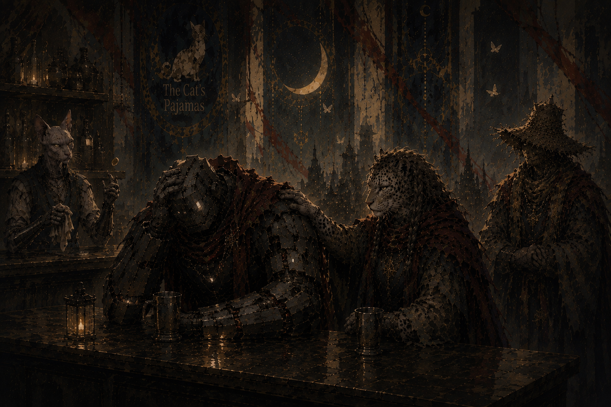
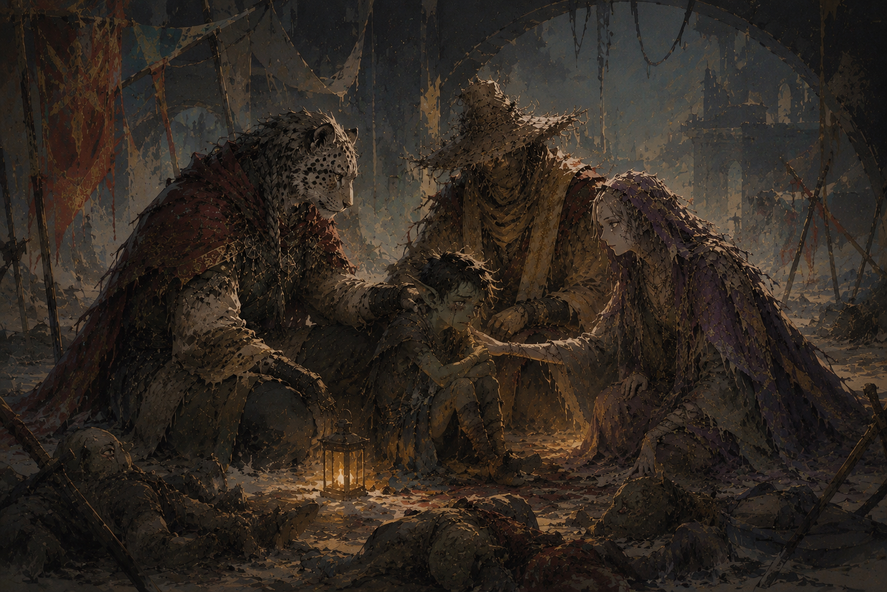

# Session 2 — Before Me Is Death

*702 confesses two thousand years of guilt just before the party finds a goblin camp slaughtered to the last — save one orphaned survivor they refuse to leave behind.*

Part of [Campaign 5: Loss, Legacy, and Lament](Campaign%205%20-%20Loss,%20Legacy,%20and%20Lament%20-%20Overall%20Summary). See all sessions at [Session Recaps](Recaps).

---

### Thelonius's demiplane

Back at the Cat's Pajamas — with no further Synchronization Malformata noticed on the walk back — Thelonius pulls the party into a hidden demiplane behind the bar (recognizable as such to three beings this old and powerful), roughly ten feet by ten: a booth, a keg, a camp stove, a closet. Brought fully up to speed — the shard, the Owl, the goblin, the loop, Feit's likely return — he handles the shard directly with his prosthetic metal arm rather than his flesh hand, a small, deliberate precaution Bas nearly misses.

He confirms it as House Volkan work, bearing the rune *Remember*, and names it for what it structurally shouldn't be able to be: shattered Tychonium — nearly unheard of, given Tychonium's reputation as the finest weapon- and armor-making material in the world. He also confirms the metal's namesake outright: he personally watched Tycho, when still mortal, dismantle a tyrannosaurus barehanded in about six seconds while it had him in its jaws. *"There's a reason the metal bears his name."* This surfaces an old thread: the sentient Tychonium blade Tyn — the Merchant King of Lost Hope, now confirmed to be the Oathstone of Tenacity — gave Bas some two thousand years ago (see [Reno](../Items/Reno)) was, per Thelonius, originally Tyn's own friend, transformed into a weapon when Tyn became an Oathstone. What that means for a blade later melted down into Emp's breastplate is left unresolved.

Thelonius advises against approaching the Volkans directly — pride will keep any of them from admitting they forged a blade of Tychonium that later broke. Instead, he sends the party in Veranath's name to **Milton's Feast**, hosted by House Richardson at the Maw, to earn the kind of favor that might open doors the Volkans would otherwise keep shut. A history check (Magerna and Meeka only — Bas whiffs it) fills in the background: Bruce Richardson, a musician who spent his life playing shows with his magical raccoon companion Milton on drums, quietly earned favors across all of Mythrir and built House Richardson into a power that holds no currency and fields no army — nobody would dare attack a house everyone else owes something to. Its motto: *"Always leave the table with more friends than you sat down with."* The feast happens every year in Junathar (Mythrir's equivalent of June) at the Maw, with every great house represented and one seat always left open for Milton. The party has two weeks and departs as Veranath's representatives, banner and all — a faded, dusty, more than slightly narcissistic red banner bearing Thelonius's own face.

Before they leave, Thelonius gives them a "span read" — a matched-pair magical telegraph, no usage limit, that lets either side reach the other by writing.

### What the shard means to Magerna

At the mention of Feit, Magerna grips his scythe tighter — it visibly radiates cold — and addresses Thelonius as "Rememberer," asking whether he could go back to being an aspect of vengeance rather than lament. Thelonius: *"I think you have gone past that. But that is not for me to decide. If you're there, I think you will know when the time comes."* Magerna's own read on the state of things: *"With the maker gone, anything's possible, or nothing's possible. I'm not sure."*

### Meeka's Divine Intervention, reworked

The table formalizes how Divine Intervention works for a player character who is her own god: at 20th level, Meeka's calls for intervention succeed automatically, and she can draw out any inactive artifact — one previously wielded by an earlier player character — from her own domain for a single use, with a one-week cooldown before she can draw another. Her first pull is **Liberty of the End**, Seraph's old hourglass artifact: black glass, sand flowing upward, roughly eight hours stationary to refill. Its powers include an All Possible Futures effect (functionally a Portent-style reroll), an Alternate Timeline effect (casting spells from a class outside her own), and Stars Without Number — once per long rest (here, once per week), opening a portal between two points on the current plane, arriving within 1d50 miles of the target with a number of creatures equal to caster level.

### Synchronization Malformata, explained

An Arcana check — Meeka alone succeeds — surfaces the mechanism behind what they saw tailing the beggar. The Owls exist to record every possible version of reality as it happens; when there aren't enough Owls present to properly attribute an event, the recording breaks, and a single event gets smeared across multiple people or places at once — which is exactly what happened with the three identical vendor conversations. Thelonius adds a piece of etymology: it's snowing in June right now, and it only ever snows when Frost Shepherds are needed — that phenomenon is itself a Synchronization Malformata, and it's literally where "Frost Shepherds" got their name. The type the party witnessed directly is a rarer, more specifically studied variant — "Type B" — that Thelonius has personally seen only a couple of times; its reappearance now, alongside the Owls, reads to him as history itself beginning to shift. Confirmed in the same exchange: the goblin fight had more than one possible outcome, and the party simply landed on the branch they experienced — implying, without further detail, that other versions of that same fight (including ones the party didn't survive) are equally "real" somewhere in what the Owls almost failed to record.

### 702 Purpose and Intent

On the way out, Bas greets 702 Purpose and Intent — a Warforged he's known for centuries, once head of security for all of Mythrir under the wartime rank of "Steelwrought," now simply back in Veranath after that rank was stood down. 702 already knows about the shard, the Owl, and the goblin despite there having been no witnesses — Warforged dream, he says, and he's spent two thousand years dreaming about what Feit did to him and his kin. Under Feit's direct control during the fall of Shaidar's Rest, 702 broke a suckling infant's neck on Feit's order — the child's father implicated, in Feit's accounting, through Za'ani, Bas, and Netiri, and through December Redd having been seen with the father six years prior. He steps voluntarily into Magerna's Zone of Truth and intentionally fails his save to prove he isn't hiding anything further, then asks the party for one thing: if they confirm Feit is truly back, tell him, so he can choose to die — and lead his fellow Warforged into the sea — rather than be enslaved again. Thelonius, flipping coins in his metal hand the whole conversation (a readiness tell, per Meeka), promises to kill 702 himself at the first sign of Feit's influence returning — 702 receives this as a mercy, not a threat. As he leaves, Magerna murmurs after him: *"How many times does someone get to have vengeance twice?"* Separately, Meeka reveals — and refuses to elaborate on — that she holds "a piece" of 702 (his own word: "peace"), taken at some point in the past, and has no intention of giving it back: *"How he is now is what's needed."*

### The goblin camp

The party finds the camp under the Western Bridge already a slaughterhouse: roughly twenty-five of the two-to-three dozen goblins who lived there stacked in a heap, gray, drained of color, killed by wounds consistent with the shard. One survivor remains, a young goblin hiding under rubble — three years old in goblin years (roughly ten, human-equivalent), one eye, an old and long-healed injury unrelated to tonight. He knows himself only as "Shithead." He explains: Grit — small, chronically underfed, the only one who'd ever been kind to him — came back that evening "different," grown to hobgoblin size and strength, and killed everyone who tried to take his "new piece of shiny." This confirms the goblin Bas killed in Session 1 had a name: **Grit**.

Bas and Magerna both refuse to hand the child off to a local guard or another intermediary — he's already told them he's afraid of being passed along and abandoned again — and decide to bring him with them to the Maw, where House Modril (Magerna's own family name, and coincidentally or not the operators of orphanages across most of the western world) runs one of its few eastern-side orphanages. He falls asleep crying in Bas's arms on the walk out. A parting message via span read confirms 702 already has the massacre in hand.

### Departure

Meeka activates Liberty of the End's Stars Without Number: 1d50 for distance (22 miles), 1d8 for direction (south) — the party, Meeka, and the sleeping child arrive 22 miles south of the Maw of Arrath, conveniently on the road along the peninsula, with the city's lights visible on the horizon. Session ends there.

---

## Appendix: Concept Art

