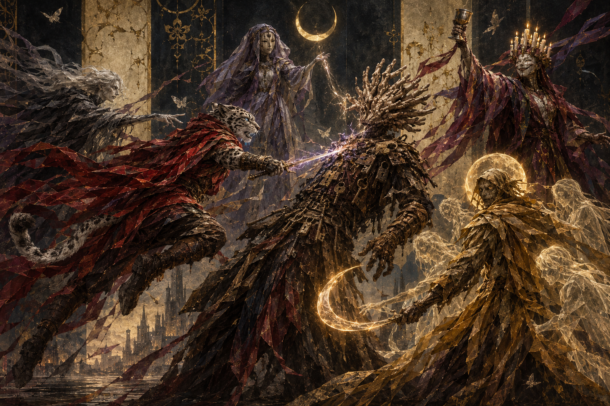
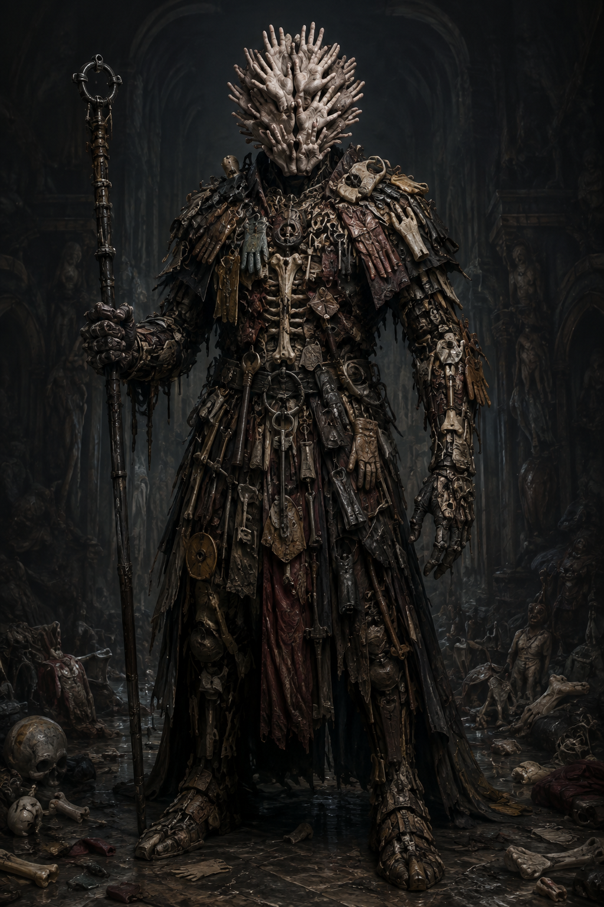
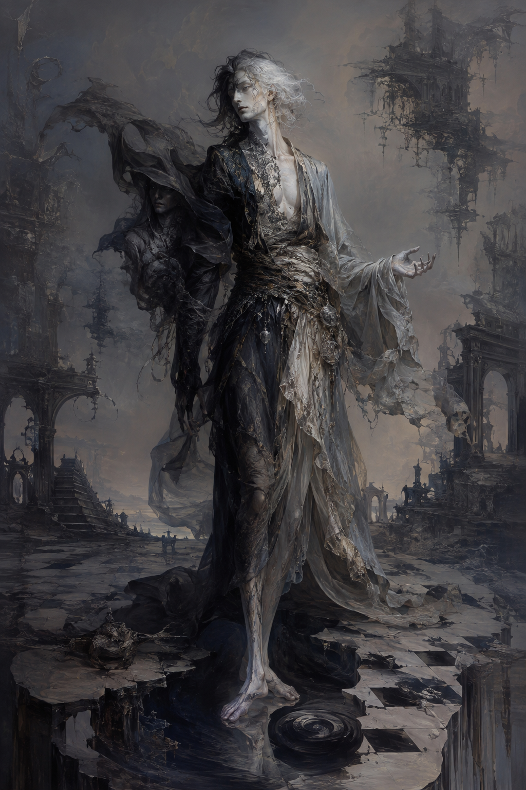
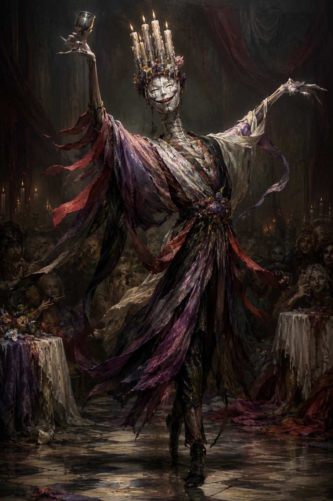

# Session 3 — The Found, The Celebrant, and The Ephemeral

*Three beings ambush the party on the road to the Maw, each one a distorted mirror of Meeka, Magerna, or Bas — and a box waiting in Meeka's own Bazaar confirms it.*

Part of [Campaign 5: Loss, Legacy, and Lament](campaign-5-loss-legacy-and-lament-overall-summary). See all sessions at [Session Recaps](recaps).

---

### The road south

Twenty-two miles south of the Maw of Arrath, with night coming on fast, the party opts to press on toward an inn some seven miles further rather than make camp in the open — safety for the sleeping goblin child outweighs a few hours' rest. Bas rigs a makeshift carrier out of rope and leather so he can keep the boy on his back hands-free; Magerna takes to the air to keep watch, offering to share his dark vision with the others once it's needed, and lays Freedom of Movement on Bas before climbing. Meeka invokes her own blessing on the party as well. High above the road, Magerna is the first to spot a lone figure walking toward them with purpose — someone who, a closer look confirms, has clearly been traveling for a very long time.

### The Found

Meeka reaches him first. He wears, cleanly stitched into a tall, broad humanoid frame, the same category of things that make up Meeka's own godly form — a single glove, broken keys, children's teeth, abandoned rusted weapons, wedding rings, scraps of letters — but arranged with none of her haphazardness, and his head is made entirely of open hands. He speaks directly into Meeka's mind before anyone can approach: *"There you are. There you are. There you are."* Then: *"Nothing lost stays lost forever. I am the Found."* Meeka recognizes every item on him immediately — all of it is from her own Bazaar of the Lost.

### The Ephemeral and the Celebrant

While the party still has the Found's measure, Bas feels his own shadow pass through him. A second figure coalesces in front of him from it, its face cycling rapidly through everyone he's ever known — Netiri, the Emperor, and, for one unsettling beat, faces of the dead he still searches for. At the same instant, Magerna's flight is dispelled outright and he begins to plummet — only to be caught gently out of the air by a third figure, who sets him down on the road with a laugh. The laughter alone is enough to wash fear, grief, and anger off the whole party; even Magerna, whose Ring of the Father makes him immune to the effect and leaves him the only one still recognizing the danger for what it is, can't fully shake the pull of it. The third figure introduces the group with a toast: *"I am the Celebrant. And I believe you already met the Found. And this one you can't quite get a look at is the Ephemeral."*

### Three against three

Magerna, unaffected and unconvinced, immediately calls on his father's ring — the ghosts of his own fallen family circling him as spirit guardians, dealing passive necrotic damage to anyone who lingers too close — and the fight begins in earnest. The Ephemeral proves able to strip the magic from exactly one target at a time: first Bas's ancestral weapons, Yesiah and Rea, go fully mundane, forcing him to fight for several rounds with plain steel (his Coiled Viper attachment, a separately-enchanted Yuan-Ti item rather than part of the Tetran inheritance, still bites); later, mid-fight, the Ephemeral shifts its attention to Magerna, and the Ring of the Father goes dark with it right as Magerna needs it most. The Found, for its part, turns out to be entirely mortal once isolated — Bas drops it in a single exchange once Meeka's Holy Weapon restores his blade's edge — only for the Celebrant to raise a glass and bring it back up off the ground a moment later, still visibly dead on its feet.

### A reality-warping toast

Partway through the fight, the road itself gives way to a demiplane the Celebrant has folded around them: a full-blown feast, complete with revelers and children, that Bas immediately recognizes as Milton's Feast itself — the destination they haven't even reached yet. Both Bas and Magerna are struck with uncontrollable laughter inside it. The Celebrant closes with a toast that hits everyone within sixty feet with a wave of psychic damage, and both spellcasters go down laughing, unable to hold concentration on anything. Rather than press the advantage with the party incapacitated, the Ephemeral uses the opening to pull all three beings out — the demiplane, the Found, and the Celebrant vanish together mid-encounter. When the laughter passes, none of the damage anyone took during the fight has stuck; whatever wounds the illusion inflicted didn't survive its ending.

### The Bazaar of the Lost

Shaken, and certain the encounter was too specifically aimed at the three of them to be coincidence, Meeka opens a passage into her own Bazaar of the Lost so the group can regroup somewhere defensible. Bas, recounting what he saw in the Ephemeral, nearly lets slip exactly how much weight those faces carried — Netiri, the Emperor, the friends he's spent two thousand years searching for — before catching himself and folding the names in among less important ones instead; Meeka reads through it anyway. Inside the Bazaar, a box waits on a table that wasn't left there by anyone in the party: a stereograph viewer and three photographs, one per person. Meeka looks through hers and watches her own face shift into the Found's. Magerna's becomes the Celebrant's. Bas's becomes the Ephemeral's. Before anyone can say much more than *"two sides of the same coin,"* they hear a door close somewhere else in the Bazaar. Session ends there.

---

## Appendix: Concept Art

